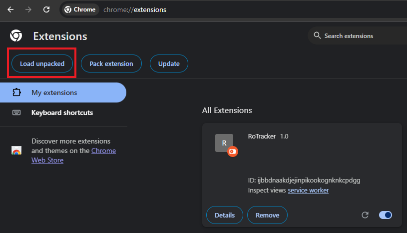
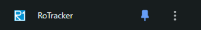
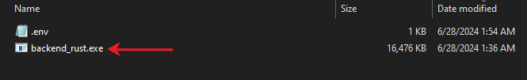
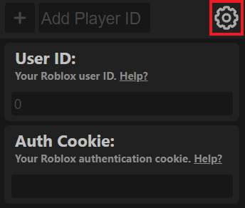

# 📊 RoTracker 📊

RoTracker is a Chrome extension that enables users to track the playtime of other Roblox players. While Roblox does not natively support this feature and no online metric services currently offer it, RoTracker fills this gap. The extension takes advantage of changes in Roblox's friend API to monitor playtime in real-time. It achieves this by collecting data through an external server hosted on the user's localhost, which makes requests to the Roblox friends API. The collected data is then used to calculate a player's playtime, as well as several more metrics mentioned below, even when Chrome is closed.

## Features ✨

#### General
- 🖥️ Clean and simple Chrome extension
- 🏃‍♂️ Lightweight server executable made in Rust
- 📊 Detailed individual metrics

#### Metrics
- ⏱️ Total time online
- 🎮 Total time in games
- 🛠️ Total time in studio
- 🗺️ Visited places
- ⏳ Total time in a Roblox place
- 🕒 Last time in a Roblox place

## Installation 🛠️

There are two things needed to use this software: the [Chrome extension]([https://linktodocumentation](https://github.com/Gotzya/RoTracker/tree/main/extension)) and the [server]([https://linktodocumentation](https://github.com/Gotzya/RoTracker/tree/main/backend_rust)). The server must be running in order to view player information in the extension, as well as track play times. RoTracker will keep track of player data as long as the server is running, even when Google Chrome is closed.

### RoTracker Chrome Extension 🌐

Because I don't want to pay the $5 ([I'm broke](https://cash.app/$Gotzya808)) to upload this to the Chrome Web Store, you will need to unpack it.

1. 📥 Install the extension files [here](https://github.com/Gotzya/RoTracker/releases/tag/v1.0.0).
2. 📂 Unzip the folder.
3. 🛠️ Load the folder as an unpacked Chrome extension in the Manage Extensions page in Google's settings. Be sure to enable Developer Mode in order to see the loading options. [[Video Help](https://www.youtube.com/watch?v=vSzaXLYTSUY)]

   
4. 📌 Pin the extension for ease of access.

   

### RoTracker Server 💻

The server is very lightweight and opens up in a terminal from an executable.

1. 📥 Install the server files [here](https://github.com/Gotzya/RoTracker/releases/tag/v1.0.0).
2. 📂 Unzip the folder.
3. ▶️ Double-click on "backend_rust.exe" to run the server.

   

## Usage 🚀

To use the RoTracker extension, you will need to provide your Roblox ID and Roblox cookie. You can find how to obtain these here:

- [Roblox ID](https://github.com/Gotzya/RoTracker/releases/tag/v1.0.0)
- [Roblox Cookie](https://github.com/Gotzya/RoTracker/releases/tag/v1.0.0)

Once you have these two, enter them into their respective textboxes and press enter to confirm the values.

## Important Notes 📋

- RoTracker can only read data for players who are your friends or friends with the profile for which you provided the user ID.
- The Roblox cookie entered must be for the Roblox account associated with the provided Roblox ID.

## Privacy and Ethical Considerations 🛡️

RoTracker is designed to provide useful metrics for Roblox players. However, it is crucial to address the potential misuse of this tool for spying or invading others' privacy. The extension only tracks data of users who are your friends or friends with the profile you provided the user ID for, adhering to Roblox's existing privacy settings. Users should only use RoTracker for legitimate purposes, respecting the privacy and consent of others. Misuse of this tool to spy on or harass other players is strongly discouraged and may violate Roblox's terms of service.
